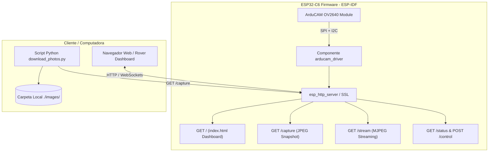

# Plan de Implementación: Integración de ArduCAM OV2640 2MP Plus en ESP32-C6 con Servidor Web Local (ESP-IDF)

Este plan describe la arquitectura y los pasos para integrar la cámara **ArduCAM Mini 2MP Plus (OV2640)** en el proyecto existente **`camera_wifi_test` (ESP-IDF v5.x / ESP32-C6)**, añadiendo soporte para captura de imágenes, streaming HTTP y la interfaz gráfica del Rover con visualización de cámara en `index.html`.

---

## Análisis Técnico: ¿Portar a ESP-IDF Nativo vs. Envolver Arduino (`arduino-esp32`)?

### Comparativa:

| Criterio | Portar Driver a ESP-IDF Nativo (Recomendado) | Envolver Arduino (`arduino-esp32` como componente) |
| :--- | :--- | :--- |
| **Complejidad de Integración** | **Baja:** La lógica de ArduCAM solo requiere SPI (CPLD/FIFO) e I2C (SCCB sensor) usando `driver/spi_master.h` y `driver/i2c_master.h`. | **Media-Alta:** Requiere configurar `arduino-esp32` en `sdkconfig`, ajustar ticks de FreeRTOS, versiones de mbedTLS y dependencias de C++. |
| **Tamaño de Binario y RAM** | **Óptimo y Ligero:** Solo incluye los registros del OV2640 (~15 KB de flash). | **Pesado:** Añade todo el runtime de Arduino (~400-800 KB extra de flash). |
| **Compatibilidad ESP32-C6 (RISC-V)** | **100% Nativo:** Utiliza las APIs oficiales de ESP-IDF v5.x. | Puede presentar inconsistencias con ciertas macros de interrupciones o pines. |
| **Rendimiento HTTP** | **Máximo:** Transmisión directa por sockets `httpd_resp_send_chunk` con buffers DMA. | Requiere capas de abstracción intermedias (`WiFiClient`). |

> [!TIP]
> **Recomendación:** **Portar el driver directamente a ESP-IDF en C/C++ modular.**
> ArduCAM para OV2640 solo necesita ~150 líneas de pegamento SPI/I2C y las tablas de registros de `ov2640_regs.h`. Es mucho más limpio, rápido y robusto que arrastrar toda la librería de Arduino.

---

## Arquitectura de la Solución

---

## User Review Required

> [!IMPORTANT]
> 1. **HTTP vs. HTTPS:** El ejemplo actual `camera_wifi_test` usa `esp_https_server` (SSL/TLS). Para visualización y streaming de cámara de alta velocidad en una red local privada, se recomienda utilizar **HTTP estándar (Puerto 80)** o permitir ambos, ya que la sobrecarga criptográfica de HTTPS en streaming MJPEG puede reducir los cuadros por segundo (FPS) en el microcontrolador.
> 2. **Pines Asignados para ESP32-C6:**
>    * **SPI:** CS: `GPIO 7`, MOSI: `GPIO 23`, MISO: `GPIO 22`, SCK: `GPIO 21`
>    * **I2C:** SDA: `GPIO 4`, SCL: `GPIO 5`

---

## Open Questions

- ¿Prefieres mantener el servidor en **HTTP plano (puerto 80)** para máxima velocidad de video y simpleza, o requieres **HTTPS (puerto 443 con certificados)** como está configurado actualmente el template?
- ¿El ESP32-C6 se conectará a un router Wi-Fi existente (modo Station `STA`), creará su propia red (modo Access Point `AP`), o ambos?

---

## Propuestas de Cambios por Componente

### 1. Driver de Cámara Nativo ESP-IDF (`main/arducam_ov2640/`)

Crear un driver ligero e independiente que reemplace la dependencia de Arduino:
* [NEW] [arducam_ov2640.h](file:///c:/Users/sanie/Documents/GitHub/mini-vehiculo-exploracion/Software/Pruebas_Funcionamiento/test_camera/camera_wifi_test/main/arducam_ov2640.h): API para inicializar SPI, I2C, verificar hardware (`ARDUCHIP_TEST1`, VID/PID), configurar resolución y disparar captura FIFO.
* [NEW] [arducam_ov2640.c](file:///c:/Users/sanie/Documents/GitHub/mini-vehiculo-exploracion/Software/Pruebas_Funcionamiento/test_camera/camera_wifi_test/main/arducam_ov2640.c): Implementación con `driver/spi_master.h` y `driver/i2c_master.h`.
* [NEW] [ov2640_regs.h](file:///c:/Users/sanie/Documents/GitHub/mini-vehiculo-exploracion/Software/Pruebas_Funcionamiento/test_camera/camera_wifi_test/main/ov2640_regs.h): Tablas de inicialización de registros del sensor OV2640 adaptadas desde `Arduino-master`.

---

### 2. Servidor HTTP y Endpoints (`main/main.c`)

Modificar el servidor web para servir la interfaz web y los flujos de imagen:
* [MODIFY] [main.c](file:///c:/Users/sanie/Documents/GitHub/mini-vehiculo-exploracion/Software/Pruebas_Funcionamiento/test_camera/camera_wifi_test/main/main.c):
  * Incrustar `index.html` en el binario usando `EMBED_TXTFILES`.
  * Manejador `root_get_handler` (`GET /`): Envía el contenido de `index.html`.
  * Manejador `capture_get_handler` (`GET /capture`): Dispara `arducam_start_capture()`, lee la longitud del FIFO y transmite los bytes JPEG en bloques (*chunked transfer*) con `Content-Type: image/jpeg`.
  * Manejador `stream_get_handler` (`GET /stream`): Bucle de transmisión continua MJPEG (`multipart/x-mixed-replace;boundary=...`).
* [MODIFY] [CMakeLists.txt](file:///c:/Users/sanie/Documents/GitHub/mini-vehiculo-exploracion/Software/Pruebas_Funcionamiento/test_camera/camera_wifi_test/main/CMakeLists.txt):
  * Agregar fuentes `arducam_ov2640.c` y registrar `EMBED_TXTFILES index.html`.
  * Agregar requerimientos `driver` y `esp_http_server`.

---

### 3. Interfaz Web del Rover (`main/index.html`)

Integrar la sección de visualización de cámara en el dashboard existente:
* [MODIFY] [index.html](file:///c:/Users/sanie/Documents/GitHub/mini-vehiculo-exploracion/Software/Pruebas_Funcionamiento/test_camera/camera_wifi_test/main/index.html):
  * Añadir tarjeta de visualización de cámara (Feed en vivo / Snapshot) con botones de **"Capturar Foto"**, **"Descargar en PC"** y selector de resolución (QVGA, VGA, SXGA, UXGA).
  * Lógica en JavaScript para refrescar el feed o solicitar una captura instantánea vía `fetch('/capture')`.

---

### 4. Herramienta de PC para Guardado Automático (`download_photos.py`)

* [NEW] [download_photos.py](file:///c:/Users/sanie/Documents/GitHub/mini-vehiculo-exploracion/Software/Pruebas_Funcionamiento/test_camera/download_photos.py):
  * Script en Python para la computadora que consulta periódicamente o a demanda el endpoint `http://<IP_ESP32>/capture` y guarda las imágenes numeradas/fechadas en la carpeta local `images/`.

---

## Plan de Verificación

### 1. Verificación de Hardware y Buses
* Compilar y flashear el firmware en el ESP32-C6.
* Verificar por monitor serie (`idf.py monitor`) que:
  * El bus SPI responda correctamente (`SPI interface OK. Value = 0x55`).
  * El sensor OV2640 sea detectado por I2C con VID `0x26` y PID `0x41`/`0x42`.
  * El ESP32-C6 obtenga dirección IP en la red Wi-Fi.

### 2. Verificación de Endpoints HTTP
* Abrir el navegador en `http://<ESP32_IP>/` y validar que cargue la interfaz del Rover con la sección de cámara.
* Acceder directamente a `http://<ESP32_IP>/capture` y verificar que el navegador muestre la imagen JPEG estática tomada en tiempo real.

### 3. Verificación de Almacenamiento en Computadora
* Ejecutar el script `python download_photos.py`.
* Comprobar que se genere y guarde la imagen en la carpeta `images/capture_YYYYMMDD_HHMMSS.jpg` sin errores de formato.
* Validar que el puerto USB-Serial permanezca libre para depurar y reflashear en cualquier momento.
