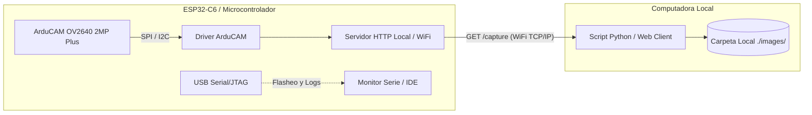

# Guía de Contexto y Funcionamiento: Servidor HTTP Wi-Fi con ArduCAM OV2640 2MP PLUS (ESP32 / ESP32-C6)

Este documento describe la arquitectura, configuración del firmware en `Arduino-master` y el desarrollo de un **Servidor HTTP Local por Wi-Fi** en el microcontrolador (ESP32-C6 / ESP32) para capturar imágenes con la cámara **ArduCAM Mini 2MP Plus (OV2640)** y almacenarlas automáticamente en una carpeta de la computadora mediante peticiones de red.

Esta arquitectura **no interfiere con el flasheo de código (`esptool`), GDB ni con los registros de depuración (*logs*) por USB-Serial**.

---

## 1. Arquitectura del Sistema



### Ventajas clave de esta arquitectura:
1. **Cero interferencias de depuración:** El puerto USB-Serial queda 100% libre para compilar, flashear (`idf.py flash` / Arduino IDE) y monitorear `ESP_LOGI` sin colisiones de puertos ni corrupción de datos.
2. **Mayor velocidad:** El ancho de banda Wi-Fi permite transferir imágenes JPEG de alta resolución (hasta 1600x1200) sustancialmente más rápido que una línea serie UART.
3. **Operación inalámbrica:** Ideal para un mini vehículo de exploración autónomo o teleoperado.

---

## 2. Especificaciones de Hardware y Pinout (ESP32-C6 / ESP32)

El módulo **ArduCAM Mini 2MP Plus (OV2640)** utiliza dos buses de comunicación:
* **SPI:** Transferencia de ráfaga (*burst*) de los datos JPEG desde la memoria FIFO de la cámara hacia el ESP32.
* **I2C (SCCB):** Configuración de registros del sensor de imagen OV2640 (resolución, balance de blancos, contraste, exposición).

### Tabla de Conexiones Recomendada

| Pin ArduCAM 2MP Plus | Función | Conexión ESP32-C6 | Conexión ESP32 Estándar | Notas |
| :--- | :--- | :--- | :--- | :--- |
| **VCC** | Alimentación | 3.3V o 5V | 3.3V o 5V | Se recomienda 3.3V/5V regulado |
| **GND** | Tierra | GND | GND | Tierra común |
| **CS** | SPI Chip Select | GPIO 7 | GPIO 5 | Configurable en código |
| **MOSI** | SPI Data Out | GPIO 23 / GPIO 19 | GPIO 23 (VSPI MOSI) | Bus SPI |
| **MISO** | SPI Data In | GPIO 22 / GPIO 18 | GPIO 19 (VSPI MISO) | Bus SPI |
| **SCK** | SPI Clock | GPIO 21 / GPIO 20 | GPIO 18 (VSPI SCK) | Bus SPI |
| **SDA** | I2C Data | GPIO 4 / GPIO 6 | GPIO 21 (I2C SDA) | Línea de control I2C |
| **SCL** | I2C Clock | GPIO 5 / GPIO 7 | GPIO 22 (I2C SCL) | Línea de control I2C |

> **Recomendación para ESP32-C6:** Evitar usar los pines de arranque (*strapping pins*) GPIO 8, 9 y 15 para líneas SPI/I2C que requieran pull-ups fijos durante el encendido.

---

## 3. Configuración del Repositorio (`Arduino-master`)

En el archivo [memorysaver.h](file:///c:/Users/sanie/Documents/GitHub/mini-vehiculo-exploracion/Software/Pruebas_Funcionamiento/test_camera/Arduino-master/ArduCAM/memorysaver.h), asegúrate de que la macro de hardware para la cámara 2MP Plus esté habilitada:

```c
#ifndef _MEMORYSAVER_
#define _MEMORYSAVER_

// Habilitar unicamente OV2640_MINI_2MP_PLUS
#define OV2640_MINI_2MP_PLUS
//#define OV5642_MINI_5MP_PLUS
//#define ARDUCAM_SHIELD_V2

#endif // _MEMORYSAVER_
```

---

## 4. Código del Firmware: Servidor HTTP Local (Arduino / ESP32)

Este firmware inicializa la cámara ArduCAM OV2640, se conecta a la red Wi-Fi local (o crea un Punto de Acceso AP) e inicia un servidor HTTP con endpoints para captura y descarga de imágenes.

### Sketch Arduino / ESP32 (`esp32_camera_http_server.ino`)

```cpp
#include <WiFi.h>
#include <WebServer.h>
#include <Wire.h>
#include <SPI.h>
#include <ArduCAM.h>
#include "memorysaver.h"

// ================= CREDENCIALES WI-FI =================
const char* ssid = "TU_RED_WIFI";
const char* password = "TU_PASSWORD";

// ================= CONFIGURACIÓN PINES =================
const int CS_PIN = 7; // Ajustar según tu conexión física
ArduCAM myCAM(OV2640, CS_PIN);

WebServer server(80);

// Buffer temporal para lectura y transmisión en bloques
#define BUFFER_SIZE 1024
uint8_t buffer[BUFFER_SIZE];

// ================= INICIALIZACIÓN DE CÁMARA =================
bool initCamera() {
  pinMode(CS_PIN, OUTPUT);
  digitalWrite(CS_PIN, HIGH);
  Wire.begin();
  SPI.begin();

  // Reset del chip CPLD ArduCAM
  myCAM.write_reg(0x07, 0x80);
  delay(100);
  myCAM.write_reg(0x07, 0x00);
  delay(100);

  // Test de integridad del bus SPI
  myCAM.write_reg(ARDUCHIP_TEST1, 0x55);
  uint8_t temp = myCAM.read_reg(ARDUCHIP_TEST1);
  if (temp != 0x55) {
    Serial.println(F("[ERROR] Fallo en la comunicación del bus SPI"));
    return false;
  }

  // Comprobar presencia del sensor OV2640 por I2C
  uint8_t vid, pid;
  myCAM.wrSensorReg8_8(0xff, 0x01);
  myCAM.rdSensorReg8_8(OV2640_CHIPID_HIGH, &vid);
  myCAM.rdSensorReg8_8(OV2640_CHIPID_LOW, &pid);
  if ((vid != 0x26) || ((pid != 0x41) && (pid != 0x42))) {
    Serial.println(F("[ERROR] Sensor OV2640 no detectado"));
    return false;
  }

  // Inicializar sensor en formato JPEG
  myCAM.set_format(JPEG);
  myCAM.InitCAM();
  myCAM.OV2640_set_JPEG_size(OV2640_1600x1200); // 1600x1200, 1024x768, 640x480, 320x240
  myCAM.clear_fifo_flag();
  Serial.println(F("[OK] ArduCAM OV2640 inicializada correctamente"));
  return true;
}

// ================= MANEJADOR HTTP: /capture =================
void handleCapture() {
  Serial.println(F("[HTTP] Petición de captura recibida"));

  // 1. Iniciar captura en memoria FIFO
  myCAM.flush_fifo();
  myCAM.clear_fifo_flag();
  myCAM.start_capture();

  // Esperar a que la captura finalice
  unsigned long startTime = millis();
  while (!myCAM.get_bit(ARDUCHIP_TRIG, CAP_DONE_MASK)) {
    if (millis() - startTime > 3000) {
      server.send(500, "text/plain", "Timeout capturando imagen");
      return;
    }
  }

  // 2. Obtener tamaño de los datos en FIFO
  uint32_t length = myCAM.read_fifo_length();
  if (length >= MAX_FIFO_SIZE || length == 0) {
    server.send(500, "text/plain", "Tamaño de FIFO inválido o sobrepasado");
    myCAM.clear_fifo_flag();
    return;
  }

  Serial.printf("[HTTP] Transmitiendo imagen JPEG (%u bytes)...\n", length);

  // 3. Iniciar respuesta HTTP streaming chunked
  WiFiClient client = server.client();
  String header = "HTTP/1.1 200 OK\r\n";
  header += "Content-Type: image/jpeg\r\n";
  header += "Content-Length: " + String(length) + "\r\n";
  header += "Access-Control-Allow-Origin: *\r\n";
  header += "Connection: close\r\n\r\n";
  client.print(header);

  // 4. Lectura SPI Burst y transmisión directa por socket TCP
  myCAM.CS_LOW();
  myCAM.set_fifo_burst();

  uint32_t bytesRemaining = length;
  while (bytesRemaining > 0) {
    size_t bytesToRead = (bytesRemaining < BUFFER_SIZE) ? bytesRemaining : BUFFER_SIZE;
    for (size_t i = 0; i < bytesToRead; i++) {
      buffer[i] = SPI.transfer(0x00);
    }
    client.write(buffer, bytesToRead);
    bytesRemaining -= bytesToRead;
  }

  myCAM.CS_HIGH();
  myCAM.clear_fifo_flag();
  Serial.println(F("[HTTP] Transmisión completada"));
}

// ================= MANEJADOR HTTP: /status =================
void handleStatus() {
  server.send(200, "application/json", "{\"status\":\"online\",\"sensor\":\"OV2640 2MP PLUS\"}");
}

// ================= SETUP Y LOOP =================
void setup() {
  Serial.begin(115200);
  Serial.println(F("\n--- Iniciando ESP32 ArduCAM HTTP Server ---"));

  if (!initCamera()) {
    Serial.println(F("[FATAL] La cámara no pudo inicializarse."));
  }

  // Conectar a red Wi-Fi
  WiFi.mode(WIFI_STA);
  WiFi.begin(ssid, password);
  Serial.print(F("Conectando a Wi-Fi"));
  while (WiFi.status() != WL_CONNECTED) {
    delay(500);
    Serial.print(F("."));
  }

  Serial.println(F("\n[WiFi] Conectado exitosamente!"));
  Serial.print(F("[WiFi] Dirección IP: http://"));
  Serial.println(WiFi.localIP());

  // Configurar Rutas HTTP
  server.on("/capture", HTTP_GET, handleCapture);
  server.on("/status", HTTP_GET, handleStatus);
  server.begin();
  Serial.println(F("[HTTP] Servidor listo. Rutas disponibles: /capture, /status"));
}

void loop() {
  server.handleClient();
}
```

---

## 5. Almacenamiento Automático de Fotos en el Computador

Desde la computadora conectada a la misma red Wi-Fi (o al punto de acceso del ESP32), se pueden capturar y guardar las fotos en una carpeta local utilizando los siguientes métodos:

### Método A: Script Python Automatizado (`download_photos.py`)

Este script realiza una petición HTTP `GET http://<IP_ESP32>/capture`, recibe los bytes de la imagen y los guarda como archivo `.jpg` con marca de tiempo en la carpeta `./images/`.

#### Instalación de librerías:
```bash
pip install requests
```

#### Código del Script:
```python
import os
import time
import requests
from datetime import datetime

# ================= CONFIGURACIÓN =================
ESP32_IP = "192.168.1.100"   # Reemplaza por la IP mostrada en el monitor serie
ENDPOINT_URL = f"http://{ESP32_IP}/capture"
OUTPUT_DIR = "images"        # Carpeta donde se almacenarán las imágenes
# =================================================

def capture_and_save_photo():
    os.makedirs(OUTPUT_DIR, exist_ok=True)
    timestamp = datetime.now().strftime("%Y%m%d_%H%M%S")
    filepath = os.path.join(OUTPUT_DIR, f"capture_{timestamp}.jpg")

    print(f"[+] Solicitando captura a {ENDPOINT_URL}...")
    start_time = time.time()

    try:
        response = requests.get(ENDPOINT_URL, timeout=10)
        
        if response.status_code == 200:
            with open(filepath, "wb") as f:
                f.write(response.content)
            
            elapsed = time.time() - start_time
            size_kb = len(response.content) / 1024.0
            print(f"[✓] Foto guardada: {filepath} ({size_kb:.2f} KB) en {elapsed:.2f} seg")
        else:
            print(f"[-] Error del servidor: Código HTTP {response.status_code}")
            print(response.text)

    except requests.exceptions.RequestException as e:
        print(f"[-] Error de conexión Wi-Fi: {e}")

if __name__ == "__main__":
    # Ejemplo 1: Disparo único
    capture_and_save_photo()

    # Ejemplo 2: Si deseas capturar periódicamente cada 5 segundos, descomenta:
    # while True:
    #     capture_and_save_photo()
    #     time.sleep(5)
```

---

### Método B: Captura Rápida mediante Consola / Terminal (cURL / PowerShell)

Sin necesidad de scripts en Python, puedes disparar y guardar la imagen directamente desde la terminal del sistema:

* **Windows PowerShell:**
  ```powershell
  Invoke-WebRequest -Uri "http://192.168.1.100/capture" -OutFile "images\foto.jpg"
  ```
* **Bash / Linux / macOS:**
  ```bash
  curl -o images/foto.jpg http://192.168.1.100/capture
  ```

---

### Método C: Visualización y Descarga desde el Navegador Web

Al navegar a `http://192.168.1.100/capture` desde cualquier navegador web (Chrome, Edge, Firefox), la imagen se renderiza inmediatamente en pantalla y se puede guardar haciendo clic derecho o integrándola en el panel de control web `index.html` del rover.

---

## 6. Comparativa: Servidor Wi-Fi HTTP vs. Comunicación Serie UART

| Característica | Servidor Wi-Fi HTTP | Comunicación Serie UART |
| :--- | :--- | :--- |
| **Interferencia con Flasheo/Debug** | **Ninguna** (USB libre para `esptool` y logs) | **Alta** (El puerto COM queda bloqueado o mezcla logs) |
| **Velocidad de Transferencia** | Alta (TCP/IP Wi-Fi @ decenas de Mbps) | Limitada a la tasa en baudios (115.2k o 921.6k) |
| **Conectividad Física** | Inalámbrica (ideal para robots/rovers) | Requiere cable USB directo o radio UART |
| **Múltiples Clientes** | Soportado (varios clientes pueden solicitar datos) | Conexión punto a punto exclusiva |
| **Integración con Interfaz Web** | Directa mediante etiquetas `` y `fetch()` | Requiere puente serie-web intermedio |

---

## 7. Diagnóstico y Consejos para ESP32-C6

1. **La cámara falla en el chequeo SPI (`temp != 0x55`):**
   * Revisa que el pin `CS` asignado coincida con la configuración física.
   * En el ESP32-C6, asegúrate de haber mapeado correctamente los pines SPI maestro (`MOSI`, `MISO`, `SCK`).
2. **La cámara falla en el chequeo I2C (VID/PID):**
   * Añadir resistencias pull-up externas de 4.7 kΩ a 3.3V en las líneas SDA y SCL si las líneas son largas.
3. **El ESP32 no conecta al Wi-Fi:**
   * El ESP32-C6 es compatible con Wi-Fi en la banda de 2.4 GHz (802.11 b/g/n/ax). Asegúrate de que la red Wi-Fi transmita en 2.4 GHz.
4. **Capturas incompletas o corruptas:**
   * Asegúrate de invocar `myCAM.clear_fifo_flag()` y `myCAM.flush_fifo()` antes de cada llamada a `start_capture()`.
